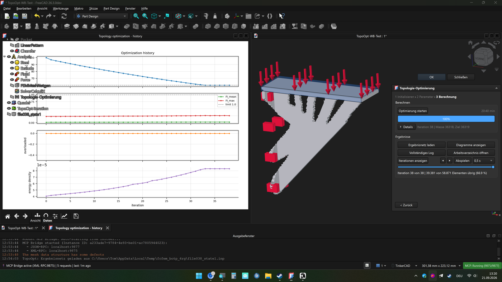
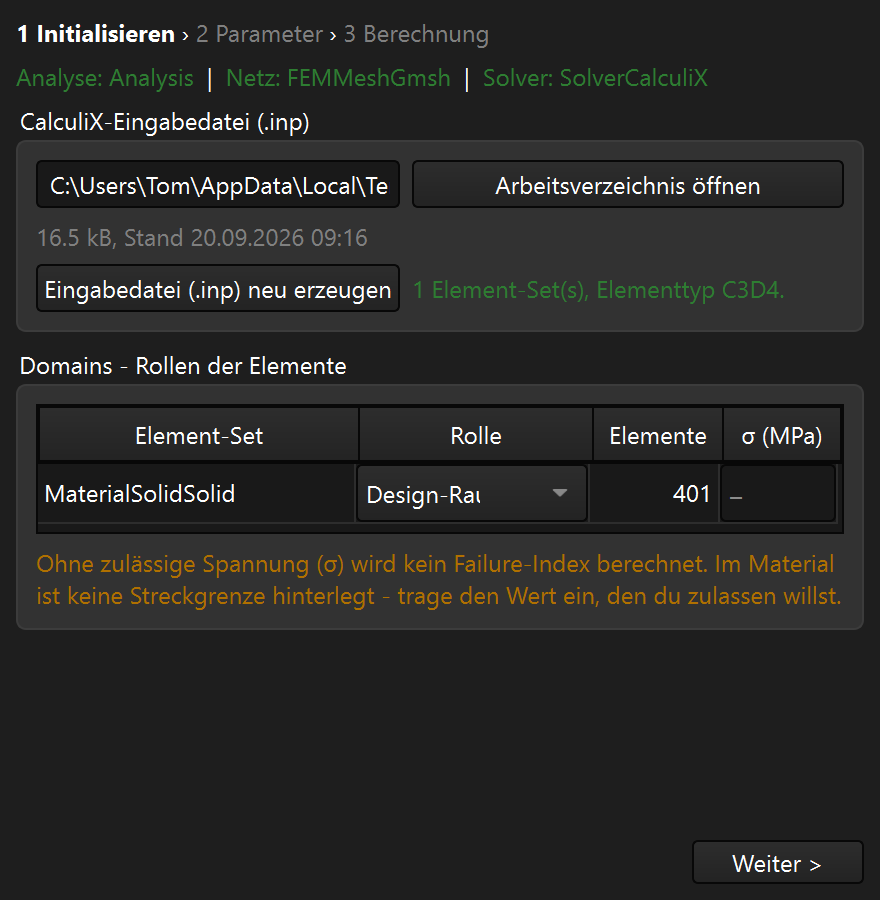
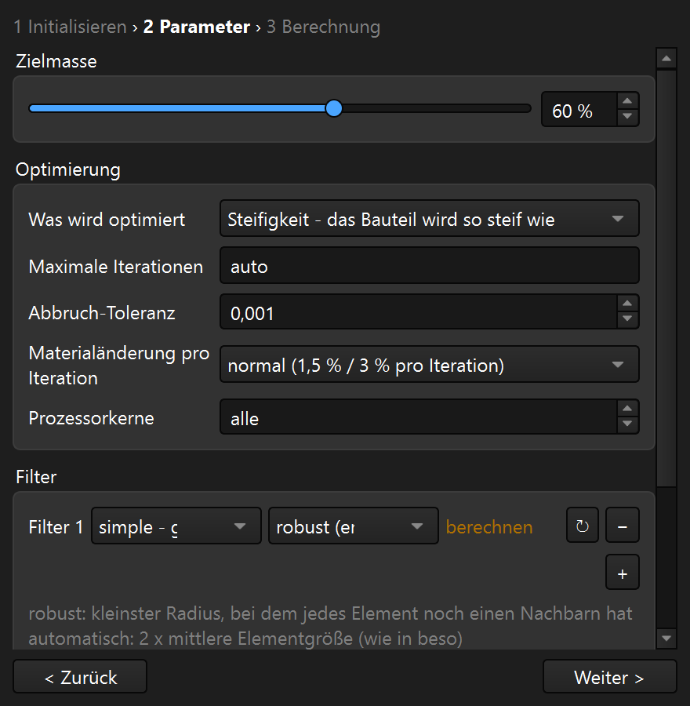
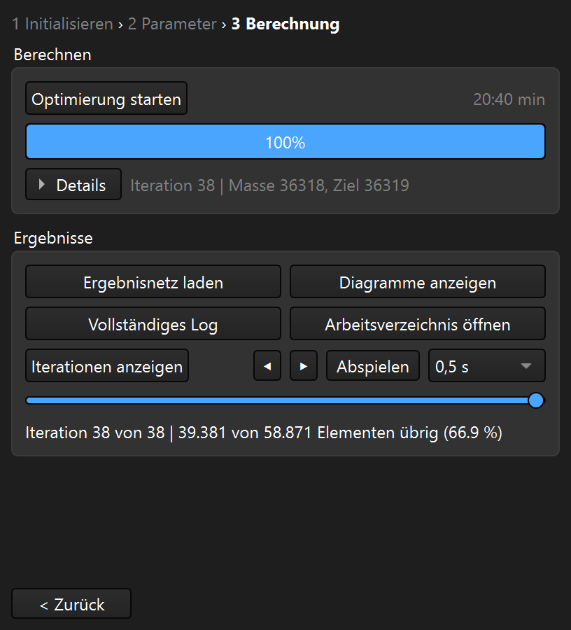

# TopoOpt

Topology optimization for FreeCAD on top of a finished FEM analysis.  The optimization is
computed by [beso](https://github.com/calculix/beso) (Bi-directional Evolutionary Structural
Optimization, by František Löffelmann) and the CalculiX solver that ships with FreeCAD.  A
reviewed copy of beso is included, so there is nothing else to install.

The addon does **not** replace the FEM workbench: mesh, materials, constraints and loads stay
where they are, the optimization object lives inside the analysis and reads from it.

## What it does

* creates a `Topologie-Optimierung` object inside the **active** FEM analysis,
* reads the element sets, mesh and solver from the analysis and finds the CalculiX input
  file (`*.inp`) - it is reused if it exists, or written on a click,
* lets you set the role of every element set (design space, non-design space, ignore),
* collects the run parameters (mass goal, stiffness or failure index, filters and ranges,
  tolerance, saved iterations) as properties of the object, so they are saved in the document,
* runs beso in a separate process - FreeCAD stays responsive, a progress bar and a stop
  button are shown, and the history can be watched in a plot window,
* loads the result back into the document: the iteration states as a VTK player and the
  final mesh (`*_state1.inp`) as a real FEM mesh.

Everything is in English in the source and translated to German when FreeCAD runs in German.

## How it looks

The assistant opens inside FreeCAD next to the model, and the optimization history is drawn in
a window of its own - here after a short run on the test model:

 

The three steps  
*Initialize* - pick up the input file (or write it) and set the role of every element set.  
*Parameters* - mass goal, optimization base, filters and their range, saved iterations.  
*Calculation* - start the run, watch the progress and load the result; the picture shows the
step right after a run.

<table>
<tr>
<td></td>
<td></td>
<td></td>
</tr>
<tr>
<td align="center">1 - Initialize</td>
<td align="center">2 - Parameters</td>
<td align="center">3 - Calculation (after a run)</td>
</tr>
</table>

## Requirements

* FreeCAD 1.0 or newer (developed and tested with 26.3)
* the FEM workbench of FreeCAD with its CalculiX solver (`ccx`)
* Python with `numpy` - both come with FreeCAD

## Installation

### With the Addon Manager (recommended)

1. *Tools → Addon manager*
2. *Configuration* (top right) → add the repository URL under *Custom repositories*:
   `https://github.com/shIxx01/TopologyOptimization`
3. install *TopoOpt* from the list and restart FreeCAD

### Manually

Copy this folder into the `Mod` directory of your FreeCAD user directory, so that
`Mod/TopologyOptimization/package.xml` exists, and restart FreeCAD.

## How to use it

1. Build a FEM analysis in the FEM workbench: mesh, material, constraints and loads.
   Activate the analysis (double click, or right click → *Activate analysis*).
2. Switch to the *TopoOpt* workbench and create the optimization object.
3. Follow the three steps of the assistant:
   * **Initialize** - pick up the input file (or write it) and set the role of every
     element set.  Exactly one set should be the design space.
   * **Parameters** - mass goal (default 60 %), optimization base, filters and their range,
     tolerance, number of saved iterations.  Shell thicknesses are read from the input file,
     they are never guessed.
   * **Calculation** - start the run, watch the progress, and load the result.
4. The field *σ (MPa)* per domain is optional: without a value the run simply reports no
   failure index.  Fill it in when you want the utilisation - a note under the list tells
   you which value your material would allow.

## What differs from beso upstream

The bundled copy is upstream [calculix/beso](https://github.com/calculix/beso) plus four
fixes and the findings below.  Every change is marked in the source and listed in
[`freecad/TopoOpt/beso/CHANGES-TopoOpt.md`](freecad/TopoOpt/beso/CHANGES-TopoOpt.md):

1. the grid key in `beso_filters.prepare2s` is built from integer cell indices instead of a
   rounded coordinate (a rounding border made the lookup miss and stopped the run with
   `KeyError`),
2. an element without a neighbour inside the filter range stops the run with a clear message
   instead of dividing by zero and quietly continuing,
3. a shell element without a thickness gives a clear message instead of an `IndexError`,
4. a casting filter with the range `"auto"` works instead of stopping with a `NameError`.

The addon itself adds two things on top:

* **robust filter range** - asks beso's own functions for the smallest range in which every
  element of the design space still has a neighbour, instead of always using "two times the
  average element size",
* **shell thickness from the input file** - `*SHELL SECTION` is read per element set, so 2D
  models are computed with their real thickness instead of beso's template value of 1 mm.

## Tests

| Test | What it covers | Result |
|---|---|---|
| `tests/headless_test.py` | core modules, configuration, radius, VTK/state readers | 134 checks |
| `tests/panel_test.py` | the assistant in a real FreeCAD GUI - steps, buttons, error cases, one real mini run | 124 checks |
| `tests/gui_test.py` | the workbench and its command in a running FreeCAD | 15 checks |
| `tests/szenario_test.py` | 16 scenarios on purpose-built tiny models (2D shell, 3D solid, all filter types, missing thickness, missing objects) and the same scenarios with the unchanged beso from GitHub | 16 runs, no failed check |
| `tests/vergleich_varianten.py` | preparation time of the bundled beso against the unchanged upstream beso | see below |

Run them with FreeCAD's interpreters, see [`Documentation/development.md`](Documentation/development.md).
Measured on a mesh with 84,395 elements and 22.5 million neighbour pairs: preparation takes
**26.8 s with the bundled beso and 27.6 s with upstream** - the fixes cost no computing time -
and both find the same average element size (1.3343 mm) and the same number of neighbour
pairs.  In the scenario matrix the bundled copy produces the same masses as upstream in 13 of
16 scenarios; the three differences are exactly the intended fixes (upstream computes on with
a division by zero where the addon stops with a message, and the casting filter with `"auto"`
only runs here).

## Documentation

* [`Documentation/architecture.md`](Documentation/architecture.md) - how the addon is built,
  what a run does and how it talks to beso
* [`Documentation/decisions.md`](Documentation/decisions.md) - the decisions behind it, with
  the measurement that settled each one
* [`Documentation/development.md`](Documentation/development.md) - install for a test, test
  recipes, debugging notes
* [`Documentation/roadmap.md`](Documentation/roadmap.md) - what is done, what comes next
* [`AGENTS.md`](AGENTS.md) - rules for working on this addon

## License

* code: LGPL-3.0-or-later (`LICENSE-Code`)
* icons and other assets: CC0-1.0 (`LICENSE-Assets`)

beso was written by **František Löffelmann** and is published under LGPLv3
(<https://github.com/calculix/beso>).  The included copy keeps its license and its README,
and the changes are documented as described above.

## Author

shIxx (<https://github.com/shIxx01>) - **not a programmer**.  The addon was written with the
support of an AI assistant, reviewed step by step, and tested on real models in FreeCAD 26.3.
